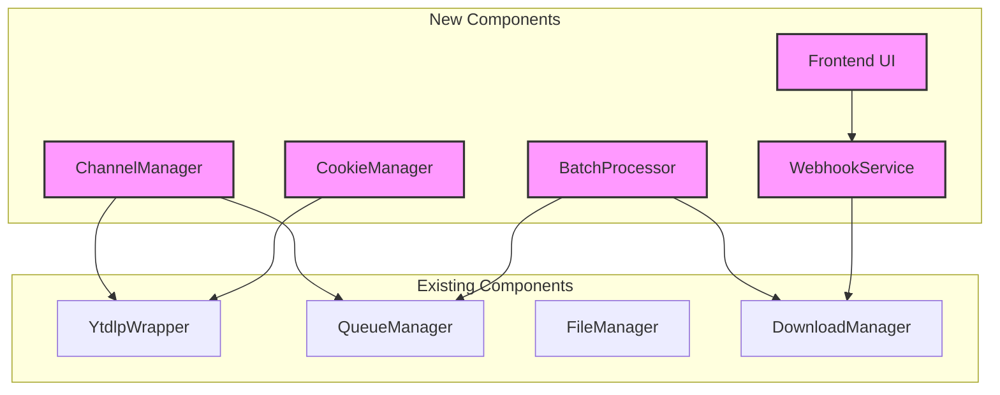

# PRD: Ultimate Media Downloader - Missing Features Implementation
Generated: 2025-11-06
Version: 1.0

## Table of Contents
1. [Source Ticket Reference](#source-ticket-reference)
2. [Technical Interpretation](#technical-interpretation)
3. [Functional Specifications](#functional-specifications)
4. [Technical Requirements & Constraints](#technical-requirements--constraints)
5. [User Stories with Acceptance Criteria](#user-stories-with-acceptance-criteria)
6. [Task Breakdown Structure](#task-breakdown-structure)
7. [Dependencies & Integration Points](#dependencies--integration-points)
8. [Risk Assessment & Mitigation](#risk-assessment--mitigation)
9. [Testing & Validation Requirements](#testing--validation-requirements)
10. [Monitoring & Observability](#monitoring--observability)
11. [Success Metrics & Definition of Done](#success-metrics--definition-of-done)
12. [Technical Debt & Future Considerations](#technical-debt--future-considerations)
13. [Appendices](#appendices)

## 1. Source Ticket Reference

### Project Context
- **Project Name**: Ultimate Media Downloader
- **Current Version**: 3.0.0 (modular architecture complete)
- **Status**: In Development - Adding Missing Features
- **Repository**: railway-yt-dlp-service

### Existing Features
- ✅ Single video downloads
- ✅ Playlist downloads (basic)
- ✅ Metadata extraction
- ✅ Quality selection
- ✅ Audio extraction
- ✅ Modular architecture

### Missing Features to Implement
- ❌ Channel Downloads (P1)
- ❌ Batch Downloads (P1)
- ❌ Webhook Notifications (P1)
- ❌ Frontend UI (P0)
- ❌ Enhanced Authentication (P2)

## 2. Technical Interpretation

### Business to Technical Translation

**Channel Downloads** → **Channel API with Filtering Engine**
- Implement channel info extraction endpoint
- Build date/duration/view count filtering system
- Integrate with existing queue manager for scalability
- Add sort capabilities for video selection

**Batch Downloads** → **Concurrent Queue Processing System**
- Extend queue manager for multi-URL handling
- Implement concurrent download limits
- Add batch status tracking with granular progress
- Build error handling with stop-on-error vs continue modes

**Webhook Notifications** → **Event-Driven Notification Service**
- Create webhook registration system per job
- Implement event dispatchers for job lifecycle
- Build retry logic with exponential backoff
- Add HMAC signature verification for security

**Frontend UI** → **Modern PWA with Real-time Updates**
- Build responsive React/Vue application
- Implement WebSocket for real-time progress
- Create mobile-first UI components
- Add offline support with service workers

**Enhanced Authentication** → **Cookie & Session Management**
- Implement cookie file upload endpoint
- Build browser cookie extraction utilities
- Create secure session storage
- Add cookie validation and refresh logic

## 3. Functional Specifications

### 3.1 Channel Downloads

#### Requirements
- **REQ-001**: System shall extract channel information including video list
- **REQ-002**: System shall support filtering by date range, duration, and view count
- **REQ-003**: System shall provide sorting by upload date, popularity, duration
- **REQ-004**: System shall integrate with existing queue for processing
- **REQ-005**: System shall handle pagination for large channels (1000+ videos)

#### Edge Cases
- Channel with no videos returns empty list with appropriate message
- Invalid channel URL returns detailed error with suggestions
- Date filters beyond channel existence are handled gracefully
- Channels with 10,000+ videos paginate efficiently

#### Error Scenarios
- Channel doesn't exist: Return 404 with helpful message
- Private channel without auth: Return 403 with authentication instructions
- Rate limited by platform: Implement backoff and retry
- Network timeout during channel fetch: Retry with exponential backoff

### 3.2 Batch Downloads

#### Requirements
- **REQ-006**: System shall accept up to 100 URLs in single batch request
- **REQ-007**: System shall process downloads with configurable concurrency (1-10)
- **REQ-008**: System shall track individual and overall batch progress
- **REQ-009**: System shall support stop-on-error and continue-on-error modes
- **REQ-010**: System shall provide batch cancellation capability

#### Edge Cases
- Duplicate URLs in batch are deduplicated automatically
- Mixed content types (video, playlist, channel) handled appropriately
- Partial batch completion saves successful downloads
- Empty URL list returns validation error

#### Error Scenarios
- Single URL failure in continue mode: Log error, continue batch
- Single URL failure in stop mode: Cancel remaining, return results
- Concurrent limit exceeded: Queue excess URLs
- Storage quota exceeded mid-batch: Graceful failure with partial results

### 3.3 Webhook Notifications

#### Requirements
- **REQ-011**: System shall support webhook registration per download job
- **REQ-012**: System shall emit events: started, progress, completed, failed
- **REQ-013**: System shall implement retry with exponential backoff (3 attempts)
- **REQ-014**: System shall sign webhooks with HMAC-SHA256
- **REQ-015**: System shall include full job context in webhook payload

#### Edge Cases
- Webhook URL unreachable: Log failure, continue download
- Webhook returns 4xx: Don't retry, log permanent failure
- Webhook returns 5xx: Retry with backoff
- Malformed webhook URL: Validation error at registration

#### Error Scenarios
- Webhook timeout (10s): Log timeout, continue download
- Invalid HMAC signature on receiver: Log security warning
- Webhook flood protection: Rate limit to 10 webhooks/second
- Network partition during webhook: Queue for retry

### 3.4 Frontend UI

#### Requirements
- **REQ-016**: UI shall be responsive from 320px to 4K displays
- **REQ-017**: UI shall provide real-time progress updates via WebSocket
- **REQ-018**: UI shall support drag-and-drop for batch URLs
- **REQ-019**: UI shall be installable as PWA on mobile/desktop
- **REQ-020**: UI shall work offline with queued downloads

#### Edge Cases
- WebSocket disconnection: Fallback to polling
- Browser storage full: Clear oldest downloads
- PWA update available: Prompt user to refresh
- Multiple tabs open: Sync state across tabs

#### Error Scenarios
- JavaScript disabled: Show basic HTML fallback
- WebSocket connection failed: Use SSE or polling
- Service worker registration failed: Continue without offline
- LocalStorage unavailable: Use memory storage

### 3.5 Enhanced Authentication

#### Requirements
- **REQ-021**: System shall accept Netscape format cookie files
- **REQ-022**: System shall extract cookies from Chrome/Firefox/Edge
- **REQ-023**: System shall securely store cookies encrypted at rest
- **REQ-024**: System shall validate cookie expiry and refresh
- **REQ-025**: System shall support multiple cookie sets per user

#### Edge Cases
- Expired cookies: Prompt for refresh
- Invalid cookie format: Provide format guide
- Browser not installed: Show manual export instructions
- Cookie conflict: Use most recent cookie

#### Error Scenarios
- Cookie decryption failed: Request re-upload
- Browser profile locked: Show unlock instructions
- Cookies rejected by platform: Clear and re-authenticate
- Storage encryption key lost: Force re-authentication

## 4. Technical Requirements & Constraints

### 4.1 System Architecture

```
Channel & Batch System Architecture:

┌─────────────────────────────────────────────────────────────┐
│                      Frontend UI                            │
│  React/Vue + WebSocket + Service Workers + PWA              │
└────────────────────┬────────────────────────────────────────┘
                     │ HTTPS/WSS
┌────────────────────▼────────────────────────────────────────┐
│                  Enhanced API Layer                         │
│  ┌──────────────────────────────────────────────────────┐  │
│  │  New Endpoints:                                      │  │
│  │  - /api/v1/channel/*                                 │  │
│  │  - /api/v1/batch/*                                   │  │
│  │  - /api/v1/webhooks/*                                │  │
│  │  - /api/v1/auth/cookies/*                            │  │
│  └────────────────────┬─────────────────────────────────┘  │
└────────────────────────┼────────────────────────────────────┘
                         │
┌────────────────────────▼────────────────────────────────────┐
│                  Service Layer Extensions                   │
│  ┌──────────────────────────────────────────────────────┐  │
│  │  ChannelManager - Channel video filtering/sorting    │  │
│  │  BatchProcessor - Concurrent batch management        │  │
│  │  WebhookService - Event dispatch & retry logic       │  │
│  │  CookieManager - Cookie storage & validation         │  │
│  └──────────────────────────────────────────────────────┘  │
└─────────────────────────────────────────────────────────────┘
```

### 4.2 Data Models

```python
# Channel Models
class ChannelInfoResponse(BaseModel):
    channel_id: str
    channel_name: str
    channel_url: str
    subscriber_count: Optional[int]
    video_count: int
    videos: List[VideoInfo]
    next_page_token: Optional[str]

class VideoInfo(BaseModel):
    id: str
    title: str
    duration: int
    upload_date: str
    view_count: Optional[int]
    thumbnail: str
    url: str

class ChannelFilter(BaseModel):
    date_after: Optional[datetime]
    date_before: Optional[datetime]
    min_duration: Optional[int]
    max_duration: Optional[int]
    min_views: Optional[int]
    max_views: Optional[int]
    sort_by: SortField = SortField.UPLOAD_DATE
    sort_order: SortOrder = SortOrder.DESC

# Batch Models
class BatchJob(BaseModel):
    batch_id: str
    urls: List[str]
    total_count: int
    completed_count: int
    failed_count: int
    status: BatchStatus
    downloads: List[DownloadJob]
    created_at: datetime
    updated_at: datetime

class BatchStatus(Enum):
    QUEUED = "queued"
    PROCESSING = "processing"
    COMPLETED = "completed"
    FAILED = "failed"
    CANCELLED = "cancelled"

# Webhook Models
class WebhookConfig(BaseModel):
    url: HttpUrl
    events: List[WebhookEvent]
    secret: Optional[str]
    retry_count: int = 3
    timeout_seconds: int = 10

class WebhookEvent(Enum):
    DOWNLOAD_STARTED = "download.started"
    DOWNLOAD_PROGRESS = "download.progress"
    DOWNLOAD_COMPLETED = "download.completed"
    DOWNLOAD_FAILED = "download.failed"
    BATCH_STARTED = "batch.started"
    BATCH_COMPLETED = "batch.completed"

class WebhookPayload(BaseModel):
    event: WebhookEvent
    timestamp: datetime
    request_id: str
    data: Dict[str, Any]
    signature: Optional[str]

# Cookie Models
class CookieSet(BaseModel):
    cookie_id: str
    name: str
    platform: str
    cookies: str  # Encrypted
    created_at: datetime
    expires_at: Optional[datetime]
    last_used: Optional[datetime]
```

### 4.3 API Contracts

```yaml
# Channel Endpoints
GET /api/v1/channel/info:
  parameters:
    - url: string (required)
    - date_after: string (YYYYMMDD)
    - date_before: string (YYYYMMDD)
    - min_duration: integer
    - max_duration: integer
    - min_views: integer
    - max_views: integer
    - sort_by: string
    - page_token: string
  response:
    200: ChannelInfoResponse
    404: Channel not found
    403: Authentication required

POST /api/v1/channel/download:
  body: ChannelDownloadRequest
  response:
    202: BatchDownloadResponse
    400: Validation error
    429: Rate limited

# Batch Endpoints
POST /api/v1/batch/download:
  body: BatchDownloadRequest
  response:
    202: BatchJob
    400: Validation error
    413: Batch too large

GET /api/v1/batch/{batch_id}:
  response:
    200: BatchJob
    404: Batch not found

DELETE /api/v1/batch/{batch_id}:
  response:
    200: CancelResponse
    404: Batch not found

# Webhook Endpoints
POST /api/v1/webhooks/register:
  body: WebhookConfig
  response:
    201: WebhookRegistration
    400: Invalid webhook URL

POST /api/v1/webhooks/test:
  body: WebhookTestRequest
  response:
    200: WebhookTestResult
    400: Test failed

# Cookie Endpoints
POST /api/v1/auth/cookies/upload:
  body: CookieUploadRequest
  response:
    201: CookieSet
    400: Invalid cookie format

GET /api/v1/auth/cookies:
  response:
    200: List[CookieSet]

DELETE /api/v1/auth/cookies/{cookie_id}:
  response:
    204: No content
    404: Cookie set not found
```

### 4.4 Performance Requirements

- **Channel Info Loading**: < 3 seconds for channels with 1000 videos
- **Batch Processing**: Support 10 concurrent downloads per batch
- **Webhook Delivery**: < 500ms from event to webhook dispatch
- **UI Responsiveness**: < 100ms for user interactions
- **WebSocket Latency**: < 50ms for progress updates
- **Cookie Validation**: < 100ms per validation check

### 4.5 Security Requirements

- **Cookie Encryption**: AES-256-GCM for cookie storage
- **Webhook Signatures**: HMAC-SHA256 with rotating secrets
- **Rate Limiting**: 100 requests/minute for channel info
- **Input Validation**: Strict URL validation to prevent SSRF
- **CORS Policy**: Configurable allowed origins for frontend
- **CSP Headers**: Strict Content Security Policy for UI

## 5. User Stories with Acceptance Criteria

### Story: USR-001 - Channel Video Selection
**As a** content curator
**I want to** browse and filter channel videos before downloading
**So that** I can select only relevant content

**Priority**: P1
**Effort**: 13 story points
**Sprint**: 1

**Acceptance Criteria**:
- [ ] Channel info loads within 3 seconds
- [ ] Filters work correctly (date, duration, views)
- [ ] Sorting changes order immediately
- [ ] Pagination works for large channels
- [ ] Selected videos can be downloaded as batch
- [ ] Filter combinations work (date AND duration)
- [ ] Empty results show helpful message

**Technical Implementation Notes**:
```python
async def get_channel_info(
    url: str,
    filters: ChannelFilter,
    page_token: Optional[str] = None
) -> ChannelInfoResponse:
    # Extract channel metadata
    info = await ytdlp_wrapper.extract_info(url, download=False)

    # Apply filters
    videos = filter_videos(info['entries'], filters)

    # Sort videos
    videos = sort_videos(videos, filters.sort_by, filters.sort_order)

    # Paginate results
    page = paginate(videos, page_token, limit=50)

    return ChannelInfoResponse(
        channel_id=info['channel_id'],
        videos=page.items,
        next_page_token=page.next_token
    )
```

### Story: USR-002 - Batch Download Management
**As a** power user
**I want to** download multiple videos simultaneously
**So that** I can save time with bulk downloads

**Priority**: P1
**Effort**: 8 story points
**Sprint**: 1

**Acceptance Criteria**:
- [ ] Accept up to 100 URLs in single request
- [ ] Process with configurable concurrency (1-10)
- [ ] Show individual progress for each URL
- [ ] Cancel batch stops all pending downloads
- [ ] Failed downloads don't affect others (continue mode)
- [ ] Batch status persists across page refreshes
- [ ] Completed files accessible immediately

### Story: USR-003 - Real-time Progress Tracking
**As a** user
**I want to** see real-time download progress
**So that** I know when downloads will complete

**Priority**: P0
**Effort**: 5 story points
**Sprint**: 2

**Acceptance Criteria**:
- [ ] Progress updates every second via WebSocket
- [ ] Shows percentage, speed, and ETA
- [ ] Multiple downloads tracked simultaneously
- [ ] Progress persists if connection drops
- [ ] Fallback to polling if WebSocket fails
- [ ] Progress bar animates smoothly
- [ ] Completed downloads show checkmark

### Story: USR-004 - Webhook Integration
**As a** developer
**I want to** receive webhook notifications
**So that** I can integrate downloads into my workflow

**Priority**: P1
**Effort**: 8 story points
**Sprint**: 2

**Acceptance Criteria**:
- [ ] Webhooks fire for all configured events
- [ ] Payload includes complete job information
- [ ] HMAC signature validates correctly
- [ ] Failed webhooks retry with backoff
- [ ] Webhook logs available for debugging
- [ ] Test endpoint validates webhook setup
- [ ] Documentation includes integration examples

### Story: USR-005 - Mobile PWA Experience
**As a** mobile user
**I want to** use the app on my phone
**So that** I can download videos on the go

**Priority**: P0
**Effort**: 13 story points
**Sprint**: 3

**Acceptance Criteria**:
- [ ] App installable on iOS and Android
- [ ] Touch targets meet accessibility standards (44x44px)
- [ ] Swipe gestures work for navigation
- [ ] Share target receives URLs from other apps
- [ ] Offline mode queues downloads
- [ ] Push notifications for completions
- [ ] Responsive from 320px to tablet sizes

## 6. Task Breakdown Structure

### Phase 1: Channel Downloads (Week 1)

#### TASK-001: Channel Info Extraction Service
**Type**: Backend
**Effort**: 8 hours
**Dependencies**: None
**Assigned to**: backend-architect

**Implementation Details**:
```python
# File: app/services/channel_manager.py
class ChannelManager:
    async def get_channel_info(self, url: str) -> ChannelInfo:
        """Extract channel metadata and video list."""
        pass

    async def filter_videos(
        self,
        videos: List[VideoInfo],
        filters: ChannelFilter
    ) -> List[VideoInfo]:
        """Apply date/duration/view filters."""
        pass

    async def sort_videos(
        self,
        videos: List[VideoInfo],
        sort_field: str,
        order: str
    ) -> List[VideoInfo]:
        """Sort videos by specified field."""
        pass
```

**Test Requirements**:
- Unit tests for filtering logic
- Integration test with real channel URL
- Performance test with 1000+ video channel

---

#### TASK-002: Channel API Endpoints
**Type**: Backend
**Effort**: 6 hours
**Dependencies**: [TASK-001]
**Assigned to**: backend-architect

**Implementation Details**:
```python
# File: app/api/v1/channel.py
@router.get("/channel/info")
async def get_channel_info(
    url: str,
    filters: ChannelFilter = Depends(),
    manager: ChannelManager = Depends(get_channel_manager)
) -> ChannelInfoResponse:
    """Get filtered channel information."""
    pass

@router.post("/channel/download")
async def download_channel(
    request: ChannelDownloadRequest,
    queue: QueueManager = Depends(get_queue_manager)
) -> BatchDownloadResponse:
    """Queue channel videos for download."""
    pass
```

---

#### TASK-003: Channel Video Filtering UI
**Type**: Frontend
**Effort**: 12 hours
**Dependencies**: [TASK-002]
**Assigned to**: frontend-developer

**Implementation Details**:
```javascript
// File: static/js/components/ChannelBrowser.js
class ChannelBrowser {
    constructor() {
        this.filters = {};
        this.videos = [];
        this.selected = new Set();
    }

    async loadChannel(url) {
        const response = await api.getChannelInfo(url, this.filters);
        this.renderVideos(response.videos);
    }

    applyFilters(filters) {
        this.filters = filters;
        this.loadChannel(this.currentUrl);
    }

    downloadSelected() {
        const urls = Array.from(this.selected);
        return api.batchDownload(urls);
    }
}
```

---

### Phase 2: Batch Downloads (Week 1-2)

#### TASK-004: Batch Processing Service
**Type**: Backend
**Effort**: 10 hours
**Dependencies**: None
**Assigned to**: python-expert

**Implementation Details**:
```python
# File: app/services/batch_processor.py
class BatchProcessor:
    def __init__(self, queue_manager: QueueManager):
        self.queue_manager = queue_manager
        self.batches = {}

    async def create_batch(
        self,
        urls: List[str],
        options: BatchOptions
    ) -> BatchJob:
        """Create and queue batch download."""
        batch_id = generate_uuid()
        batch = BatchJob(
            batch_id=batch_id,
            urls=urls,
            status=BatchStatus.QUEUED
        )

        # Queue individual downloads
        for url in urls:
            job = await self.queue_manager.enqueue(url, batch_id=batch_id)
            batch.downloads.append(job)

        self.batches[batch_id] = batch
        return batch

    async def get_batch_status(self, batch_id: str) -> BatchJob:
        """Get current batch status with all downloads."""
        pass

    async def cancel_batch(self, batch_id: str) -> bool:
        """Cancel all pending downloads in batch."""
        pass
```

---

#### TASK-005: Batch API Endpoints
**Type**: Backend
**Effort**: 4 hours
**Dependencies**: [TASK-004]
**Assigned to**: backend-architect

**Implementation Details**:
```python
# File: app/api/v1/batch.py
@router.post("/batch/download")
async def create_batch(
    request: BatchDownloadRequest,
    processor: BatchProcessor = Depends(get_batch_processor)
) -> BatchJob:
    """Create batch download job."""
    return await processor.create_batch(
        urls=request.urls,
        options=request.options
    )

@router.get("/batch/{batch_id}")
async def get_batch_status(
    batch_id: str,
    processor: BatchProcessor = Depends(get_batch_processor)
) -> BatchJob:
    """Get batch download status."""
    return await processor.get_batch_status(batch_id)
```

---

#### TASK-006: Concurrent Download Manager
**Type**: Backend
**Effort**: 8 hours
**Dependencies**: [TASK-004]
**Assigned to**: python-expert

**Implementation Details**:
```python
# File: app/services/queue_manager.py (extend existing)
class EnhancedQueueManager(QueueManager):
    async def process_batch(
        self,
        batch_id: str,
        concurrent_limit: int = 3
    ):
        """Process batch with concurrency control."""
        semaphore = asyncio.Semaphore(concurrent_limit)

        async def download_with_limit(job):
            async with semaphore:
                return await self.process_job(job)

        # Process downloads concurrently
        tasks = [download_with_limit(job) for job in batch_jobs]
        results = await asyncio.gather(*tasks, return_exceptions=True)
        return results
```

---

### Phase 3: Webhook Notifications (Week 2)

#### TASK-007: Webhook Service Implementation
**Type**: Backend
**Effort**: 12 hours
**Dependencies**: None
**Assigned to**: backend-architect

**Implementation Details**:
```python
# File: app/services/webhook_service.py
class WebhookService:
    def __init__(self):
        self.registrations = {}
        self.retry_queue = asyncio.Queue()

    async def register_webhook(
        self,
        request_id: str,
        config: WebhookConfig
    ) -> str:
        """Register webhook for request."""
        webhook_id = generate_uuid()
        self.registrations[request_id] = config
        return webhook_id

    async def dispatch_event(
        self,
        request_id: str,
        event: WebhookEvent,
        data: Dict[str, Any]
    ):
        """Dispatch webhook with retry logic."""
        config = self.registrations.get(request_id)
        if not config or event not in config.events:
            return

        payload = WebhookPayload(
            event=event,
            timestamp=datetime.now(),
            request_id=request_id,
            data=data
        )

        # Sign payload
        if config.secret:
            payload.signature = self._sign_payload(payload, config.secret)

        # Dispatch with retry
        await self._send_with_retry(config.url, payload, config.retry_count)

    async def _send_with_retry(
        self,
        url: str,
        payload: WebhookPayload,
        max_retries: int
    ):
        """Send webhook with exponential backoff."""
        for attempt in range(max_retries):
            try:
                async with httpx.AsyncClient() as client:
                    response = await client.post(
                        url,
                        json=payload.dict(),
                        timeout=10
                    )
                    if response.status_code < 500:
                        return  # Success or permanent failure
            except Exception as e:
                logger.warning(f"Webhook attempt {attempt + 1} failed: {e}")

            # Exponential backoff
            await asyncio.sleep(2 ** attempt)

    def _sign_payload(self, payload: WebhookPayload, secret: str) -> str:
        """Generate HMAC signature."""
        message = json.dumps(payload.dict(), sort_keys=True)
        signature = hmac.new(
            secret.encode(),
            message.encode(),
            hashlib.sha256
        ).hexdigest()
        return f"sha256={signature}"
```

---

#### TASK-008: Webhook Event Integration
**Type**: Backend
**Effort**: 6 hours
**Dependencies**: [TASK-007]
**Assigned to**: backend-architect

**Implementation Details**:
```python
# File: app/services/download_manager.py (extend)
class DownloadManager:
    def __init__(self, webhook_service: WebhookService):
        self.webhook_service = webhook_service

    async def start_download(self, request: DownloadRequest):
        # Register webhook if provided
        if request.webhook_url:
            await self.webhook_service.register_webhook(
                request.request_id,
                WebhookConfig(url=request.webhook_url)
            )

        # Dispatch started event
        await self.webhook_service.dispatch_event(
            request.request_id,
            WebhookEvent.DOWNLOAD_STARTED,
            {"url": request.url}
        )

        # ... download logic ...

        # Dispatch progress events during download
        async def progress_callback(progress_data):
            await self.webhook_service.dispatch_event(
                request.request_id,
                WebhookEvent.DOWNLOAD_PROGRESS,
                progress_data
            )
```

---

### Phase 4: Frontend UI (Week 2-3)

#### TASK-009: React/Vue Application Setup
**Type**: Frontend
**Effort**: 8 hours
**Dependencies**: None
**Assigned to**: frontend-developer

**Implementation Details**:
```javascript
// File: frontend/src/App.vue
<template>
  <div id="app">
    <Header />
    <router-view />
    <ProgressBar :downloads="activeDownloads" />
    <NotificationToast />
  </div>
</template>

<script>
import { defineComponent } from 'vue';
import { useDownloadStore } from './stores/downloads';
import { useWebSocket } from './composables/websocket';

export default defineComponent({
  setup() {
    const downloadStore = useDownloadStore();
    const { connect } = useWebSocket();

    onMounted(() => {
      connect('/ws/progress');
    });

    return {
      activeDownloads: computed(() => downloadStore.active)
    };
  }
});
</script>
```

---

#### TASK-010: Download Form Components
**Type**: Frontend
**Effort**: 10 hours
**Dependencies**: [TASK-009]
**Assigned to**: frontend-developer

**Implementation Details**:
```vue
<!-- File: frontend/src/components/DownloadForm.vue -->
<template>
  <form @submit.prevent="handleDownload" class="download-form">
    <div class="url-input-group">
      <input
        v-model="url"
        type="url"
        placeholder="Paste video URL here..."
        class="url-input"
        @paste="handlePaste"
      />
      <button type="submit" :disabled="!isValidUrl">
        Download
      </button>
    </div>

    <AdvancedOptions v-model="options" />

    <QualitySelector
      v-if="formats.length"
      v-model="selectedFormat"
      :formats="formats"
    />
  </form>
</template>

<script>
import { ref, computed } from 'vue';
import { useDownloadStore } from '@/stores/downloads';
import { validateUrl, getFormats } from '@/utils/validation';

export default {
  setup() {
    const url = ref('');
    const options = ref({});
    const formats = ref([]);
    const selectedFormat = ref('best');
    const downloadStore = useDownloadStore();

    const isValidUrl = computed(() => validateUrl(url.value));

    const handlePaste = async (event) => {
      const pastedUrl = event.clipboardData.getData('text');
      if (validateUrl(pastedUrl)) {
        formats.value = await getFormats(pastedUrl);
      }
    };

    const handleDownload = async () => {
      await downloadStore.createDownload({
        url: url.value,
        format: selectedFormat.value,
        ...options.value
      });
    };

    return {
      url,
      options,
      formats,
      selectedFormat,
      isValidUrl,
      handlePaste,
      handleDownload
    };
  }
};
</script>
```

---

#### TASK-011: Real-time Progress WebSocket
**Type**: Frontend
**Effort**: 8 hours
**Dependencies**: [TASK-009]
**Assigned to**: frontend-developer

**Implementation Details**:
```javascript
// File: frontend/src/composables/websocket.js
import { ref, onUnmounted } from 'vue';
import { useDownloadStore } from '@/stores/downloads';

export function useWebSocket() {
  const ws = ref(null);
  const isConnected = ref(false);
  const downloadStore = useDownloadStore();

  const connect = (url) => {
    ws.value = new WebSocket(`${window.location.origin}${url}`);

    ws.value.onopen = () => {
      isConnected.value = true;
      console.log('WebSocket connected');
    };

    ws.value.onmessage = (event) => {
      const data = JSON.parse(event.data);

      switch(data.type) {
        case 'progress':
          downloadStore.updateProgress(data.request_id, data.progress);
          break;
        case 'completed':
          downloadStore.markCompleted(data.request_id, data.file_url);
          break;
        case 'error':
          downloadStore.markFailed(data.request_id, data.error);
          break;
      }
    };

    ws.value.onerror = (error) => {
      console.error('WebSocket error:', error);
      // Fallback to polling
      startPolling();
    };

    ws.value.onclose = () => {
      isConnected.value = false;
      // Reconnect after 5 seconds
      setTimeout(() => connect(url), 5000);
    };
  };

  const startPolling = () => {
    // Implement polling fallback
    const pollInterval = setInterval(async () => {
      const updates = await downloadStore.fetchProgressUpdates();
      updates.forEach(update => {
        downloadStore.updateProgress(update.request_id, update.progress);
      });
    }, 1000);

    onUnmounted(() => clearInterval(pollInterval));
  };

  onUnmounted(() => {
    if (ws.value) {
      ws.value.close();
    }
  });

  return {
    connect,
    isConnected,
    send: (data) => ws.value?.send(JSON.stringify(data))
  };
}
```

---

#### TASK-012: Mobile-Responsive UI
**Type**: Frontend
**Effort**: 10 hours
**Dependencies**: [TASK-010]
**Assigned to**: frontend-developer

**Implementation Details**:
```css
/* File: frontend/src/styles/responsive.css */
/* Mobile-first approach */
.container {
  padding: 1rem;
  max-width: 100%;
}

.url-input {
  width: 100%;
  padding: 0.75rem;
  font-size: 16px; /* Prevent zoom on iOS */
  border-radius: 8px;
  border: 2px solid var(--border-color);
}

.download-button {
  width: 100%;
  padding: 0.75rem 1.5rem;
  min-height: 44px; /* Touch target */
  font-size: 1rem;
  border-radius: 8px;
  background: var(--primary-color);
  color: white;
  touch-action: manipulation; /* Improve touch response */
}

/* Tablet (768px+) */
@media (min-width: 768px) {
  .container {
    max-width: 720px;
    margin: 0 auto;
  }

  .url-input-group {
    display: flex;
    gap: 1rem;
  }

  .download-button {
    width: auto;
  }
}

/* Desktop (1024px+) */
@media (min-width: 1024px) {
  .container {
    max-width: 960px;
  }

  .advanced-options {
    display: grid;
    grid-template-columns: repeat(2, 1fr);
    gap: 1rem;
  }
}

/* Dark mode support */
@media (prefers-color-scheme: dark) {
  :root {
    --bg-color: #1a1a1a;
    --text-color: #e0e0e0;
    --border-color: #333;
  }
}
```

---

#### TASK-013: PWA Configuration
**Type**: Frontend
**Effort**: 6 hours
**Dependencies**: [TASK-009]
**Assigned to**: frontend-developer

**Implementation Details**:
```javascript
// File: frontend/src/service-worker.js
import { precacheAndRoute } from 'workbox-precaching';
import { registerRoute } from 'workbox-routing';
import { StaleWhileRevalidate, NetworkFirst } from 'workbox-strategies';

// Precache static assets
precacheAndRoute(self.__WB_MANIFEST);

// Cache API responses
registerRoute(
  ({ url }) => url.pathname.startsWith('/api/v1/metadata'),
  new StaleWhileRevalidate({
    cacheName: 'api-cache',
  })
);

// Queue downloads when offline
self.addEventListener('fetch', (event) => {
  if (event.request.url.includes('/api/v1/download')) {
    event.respondWith(
      fetch(event.request.clone()).catch(() => {
        // Queue for later when online
        return queueDownload(event.request);
      })
    );
  }
});

// Background sync for queued downloads
self.addEventListener('sync', (event) => {
  if (event.tag === 'download-queue') {
    event.waitUntil(processQueuedDownloads());
  }
});

// File: frontend/public/manifest.json
{
  "name": "Ultimate Media Downloader",
  "short_name": "Downloader",
  "description": "Download videos from 1000+ platforms",
  "start_url": "/",
  "display": "standalone",
  "theme_color": "#4A90E2",
  "background_color": "#ffffff",
  "icons": [
    {
      "src": "/icon-192.png",
      "sizes": "192x192",
      "type": "image/png"
    },
    {
      "src": "/icon-512.png",
      "sizes": "512x512",
      "type": "image/png"
    }
  ],
  "share_target": {
    "action": "/share",
    "method": "GET",
    "params": {
      "url": "url"
    }
  }
}
```

---

### Phase 5: Enhanced Authentication (Week 3)

#### TASK-014: Cookie Storage Service
**Type**: Backend
**Effort**: 8 hours
**Dependencies**: None
**Assigned to**: backend-architect

**Implementation Details**:
```python
# File: app/services/cookie_manager.py
import json
from cryptography.fernet import Fernet
from typing import Optional, List

class CookieManager:
    def __init__(self, encryption_key: str):
        self.fernet = Fernet(encryption_key.encode())
        self.storage_path = Path("data/cookies")
        self.storage_path.mkdir(exist_ok=True)

    async def store_cookies(
        self,
        cookie_set: CookieSet
    ) -> str:
        """Store encrypted cookies."""
        # Encrypt cookies
        encrypted = self.fernet.encrypt(cookie_set.cookies.encode())

        # Store to file
        file_path = self.storage_path / f"{cookie_set.cookie_id}.enc"
        async with aiofiles.open(file_path, 'wb') as f:
            await f.write(encrypted)

        # Store metadata
        metadata = {
            "id": cookie_set.cookie_id,
            "name": cookie_set.name,
            "platform": cookie_set.platform,
            "created_at": cookie_set.created_at.isoformat(),
            "expires_at": cookie_set.expires_at.isoformat() if cookie_set.expires_at else None
        }

        meta_path = self.storage_path / f"{cookie_set.cookie_id}.meta"
        async with aiofiles.open(meta_path, 'w') as f:
            await f.write(json.dumps(metadata))

        return cookie_set.cookie_id

    async def get_cookies(
        self,
        cookie_id: str
    ) -> Optional[str]:
        """Retrieve and decrypt cookies."""
        file_path = self.storage_path / f"{cookie_id}.enc"
        if not file_path.exists():
            return None

        async with aiofiles.open(file_path, 'rb') as f:
            encrypted = await f.read()

        # Decrypt cookies
        decrypted = self.fernet.decrypt(encrypted)
        return decrypted.decode()

    async def validate_cookies(
        self,
        cookie_id: str
    ) -> bool:
        """Check if cookies are still valid."""
        meta_path = self.storage_path / f"{cookie_id}.meta"
        if not meta_path.exists():
            return False

        async with aiofiles.open(meta_path, 'r') as f:
            metadata = json.loads(await f.read())

        # Check expiry
        if metadata.get('expires_at'):
            expires = datetime.fromisoformat(metadata['expires_at'])
            if expires < datetime.now():
                return False

        return True
```

---

#### TASK-015: Browser Cookie Extraction
**Type**: Backend
**Effort**: 10 hours
**Dependencies**: None
**Assigned to**: python-expert

**Implementation Details**:
```python
# File: app/services/browser_cookies.py
import sqlite3
import json
from pathlib import Path
import platform

class BrowserCookieExtractor:
    """Extract cookies from installed browsers."""

    BROWSER_PATHS = {
        'chrome': {
            'darwin': '~/Library/Application Support/Google/Chrome/Default/Cookies',
            'linux': '~/.config/google-chrome/Default/Cookies',
            'win32': '%APPDATA%/../Local/Google/Chrome/User Data/Default/Cookies'
        },
        'firefox': {
            'darwin': '~/Library/Application Support/Firefox/Profiles',
            'linux': '~/.mozilla/firefox',
            'win32': '%APPDATA%/Mozilla/Firefox/Profiles'
        },
        'edge': {
            'darwin': '~/Library/Application Support/Microsoft Edge/Default/Cookies',
            'linux': '~/.config/microsoft-edge/Default/Cookies',
            'win32': '%APPDATA%/../Local/Microsoft/Edge/User Data/Default/Cookies'
        }
    }

    async def extract_cookies(
        self,
        browser: str,
        domain: Optional[str] = None
    ) -> str:
        """Extract cookies from browser in Netscape format."""
        system = platform.system().lower()
        if system == 'darwin':
            system = 'darwin'
        elif system == 'windows':
            system = 'win32'
        else:
            system = 'linux'

        cookie_path = self._get_cookie_path(browser, system)
        if not cookie_path or not cookie_path.exists():
            raise ValueError(f"Browser {browser} not found")

        if browser == 'firefox':
            return await self._extract_firefox_cookies(cookie_path, domain)
        else:
            return await self._extract_chromium_cookies(cookie_path, domain)

    def _get_cookie_path(self, browser: str, system: str) -> Optional[Path]:
        """Get browser cookie database path."""
        path_template = self.BROWSER_PATHS.get(browser, {}).get(system)
        if not path_template:
            return None

        path = Path(path_template).expanduser()

        # For Firefox, find the default profile
        if browser == 'firefox' and path.is_dir():
            profiles = list(path.glob('*.default*'))
            if profiles:
                return profiles[0] / 'cookies.sqlite'

        return path

    async def _extract_chromium_cookies(
        self,
        cookie_path: Path,
        domain: Optional[str]
    ) -> str:
        """Extract cookies from Chromium-based browsers."""
        # Copy database to temp location (browser may lock it)
        import shutil
        import tempfile

        with tempfile.NamedTemporaryFile(delete=False) as tmp:
            shutil.copy2(cookie_path, tmp.name)

            conn = sqlite3.connect(tmp.name)
            cursor = conn.cursor()

            query = "SELECT host_key, name, value, path, expires_utc, is_secure, is_httponly FROM cookies"
            if domain:
                query += f" WHERE host_key LIKE '%{domain}%'"

            cursor.execute(query)

            # Convert to Netscape format
            netscape_cookies = "# Netscape HTTP Cookie File\n"
            for row in cursor.fetchall():
                host, name, value, path, expires, secure, httponly = row

                # Convert Chrome timestamp to Unix timestamp
                if expires:
                    expires = (expires / 1000000) - 11644473600

                netscape_cookies += f"{host}\t{'TRUE'}\t{path}\t"
                netscape_cookies += f"{'TRUE' if secure else 'FALSE'}\t"
                netscape_cookies += f"{int(expires) if expires else 0}\t"
                netscape_cookies += f"{name}\t{value}\n"

            conn.close()
            Path(tmp.name).unlink()

        return netscape_cookies
```

---

#### TASK-016: Cookie API Endpoints
**Type**: Backend
**Effort**: 4 hours
**Dependencies**: [TASK-014, TASK-015]
**Assigned to**: backend-architect

**Implementation Details**:
```python
# File: app/api/v1/auth.py (extend existing)
from app.services.cookie_manager import CookieManager
from app.services.browser_cookies import BrowserCookieExtractor

@router.post("/auth/cookies/upload")
async def upload_cookies(
    request: CookieUploadRequest,
    cookie_manager: CookieManager = Depends(get_cookie_manager)
) -> CookieSet:
    """Upload cookies in Netscape format."""
    # Validate cookie format
    if not validate_netscape_format(request.cookies):
        raise HTTPException(400, "Invalid cookie format")

    cookie_set = CookieSet(
        cookie_id=generate_uuid(),
        name=request.name,
        platform=detect_platform(request.cookies),
        cookies=request.cookies,
        created_at=datetime.now()
    )

    await cookie_manager.store_cookies(cookie_set)
    return cookie_set

@router.post("/auth/cookies/extract")
async def extract_browser_cookies(
    browser: str = Query(..., regex="^(chrome|firefox|edge)$"),
    domain: Optional[str] = None,
    extractor: BrowserCookieExtractor = Depends()
) -> CookieSet:
    """Extract cookies from browser."""
    try:
        cookies = await extractor.extract_cookies(browser, domain)

        cookie_set = CookieSet(
            cookie_id=generate_uuid(),
            name=f"{browser}_cookies",
            platform=domain or "all",
            cookies=cookies,
            created_at=datetime.now()
        )

        await cookie_manager.store_cookies(cookie_set)
        return cookie_set

    except Exception as e:
        raise HTTPException(400, f"Failed to extract cookies: {str(e)}")
```

## 7. Dependencies & Integration Points

### 7.1 Internal Dependencies



### 7.2 External Dependencies

- **yt-dlp**: Core media extraction library
- **FastAPI**: Web framework
- **httpx**: Async HTTP client for webhooks
- **cryptography**: Cookie encryption
- **Vue/React**: Frontend framework
- **WebSocket**: Real-time communication

### 7.3 Integration Specifications

```python
# Channel to Queue Integration
async def integrate_channel_queue(
    channel_manager: ChannelManager,
    queue_manager: QueueManager,
    request: ChannelDownloadRequest
):
    # Get filtered videos from channel
    videos = await channel_manager.get_filtered_videos(
        request.url,
        request.filters
    )

    # Queue each video
    batch_id = generate_uuid()
    for video in videos:
        await queue_manager.enqueue(
            url=video.url,
            batch_id=batch_id,
            options=request.download_options
        )

# Webhook to Download Integration
async def integrate_webhook_download(
    webhook_service: WebhookService,
    download_manager: DownloadManager,
    request: DownloadRequest
):
    # Register webhooks
    if request.webhook_url:
        await webhook_service.register(
            request.request_id,
            request.webhook_url
        )

    # Hook into download events
    download_manager.on_progress = lambda p: webhook_service.dispatch(
        request.request_id,
        WebhookEvent.DOWNLOAD_PROGRESS,
        p
    )
```

## 8. Risk Assessment & Mitigation

| Risk | Probability | Impact | Mitigation Strategy |
|------|------------|--------|-------------------|
| Channel API rate limiting | High | High | Implement caching, respect rate limits, add backoff |
| Webhook flooding | Medium | High | Rate limit webhooks, queue for delivery |
| Cookie encryption key loss | Low | Critical | Backup keys, implement key rotation |
| Frontend browser compatibility | Medium | Medium | Test on all major browsers, use polyfills |
| Batch download memory overflow | Low | High | Stream processing, limit batch size |
| WebSocket connection drops | High | Low | Automatic reconnection, polling fallback |

## 9. Testing & Validation Requirements

### 9.1 Unit Tests

```python
# Test: Channel filtering
async def test_channel_filter_by_date():
    manager = ChannelManager()
    videos = [
        VideoInfo(upload_date="20250101", ...),
        VideoInfo(upload_date="20250201", ...),
        VideoInfo(upload_date="20250301", ...)
    ]

    filtered = await manager.filter_videos(
        videos,
        ChannelFilter(date_after="20250115", date_before="20250215")
    )

    assert len(filtered) == 1
    assert filtered[0].upload_date == "20250201"

# Test: Batch processing
async def test_batch_concurrent_limit():
    processor = BatchProcessor(mock_queue)
    urls = ["url1", "url2", "url3", "url4", "url5"]

    batch = await processor.create_batch(
        urls,
        BatchOptions(concurrent_limit=2)
    )

    # Verify only 2 downloads run simultaneously
    assert mock_queue.concurrent_count <= 2

# Test: Webhook retry
async def test_webhook_exponential_backoff():
    service = WebhookService()

    with mock_server(fail_count=2) as server:
        await service.dispatch_event(
            "req123",
            WebhookEvent.DOWNLOAD_COMPLETED,
            {}
        )

        # Verify retry timing
        assert server.request_times[1] - server.request_times[0] >= 2
        assert server.request_times[2] - server.request_times[1] >= 4
```

### 9.2 Integration Tests

```python
# Test: End-to-end channel download
async def test_channel_download_flow():
    # Setup
    channel_url = "https://youtube.com/@testchannel"

    # Get channel info
    response = await client.get(
        "/api/v1/channel/info",
        params={"url": channel_url}
    )
    assert response.status_code == 200

    # Download filtered videos
    response = await client.post(
        "/api/v1/channel/download",
        json={
            "url": channel_url,
            "date_after": "20250101",
            "max_downloads": 5
        }
    )
    assert response.status_code == 202
    batch_id = response.json()["batch_id"]

    # Check batch status
    response = await client.get(f"/api/v1/batch/{batch_id}")
    assert response.json()["total_count"] == 5
```

### 9.3 Performance Tests

- Channel with 5000 videos: Load time < 5 seconds
- Batch of 100 URLs: Queue time < 2 seconds
- 1000 webhook dispatches: < 100 seconds total
- UI with 50 active downloads: 60 FPS maintained

### 9.4 Browser Testing Matrix

| Browser | Version | Desktop | Mobile | PWA |
|---------|---------|---------|--------|-----|
| Chrome | 120+ | ✓ | ✓ | ✓ |
| Firefox | 120+ | ✓ | ✓ | ✓ |
| Safari | 17+ | ✓ | ✓ | ✓ |
| Edge | 120+ | ✓ | ✓ | ✓ |

## 10. Monitoring & Observability

### 10.1 Metrics

```python
# Prometheus metrics
channel_info_duration = Histogram(
    'channel_info_duration_seconds',
    'Time to fetch channel info'
)

batch_downloads_total = Counter(
    'batch_downloads_total',
    'Total batch downloads initiated'
)

webhook_delivery_success = Counter(
    'webhook_delivery_success_total',
    'Successful webhook deliveries'
)

webhook_delivery_failure = Counter(
    'webhook_delivery_failure_total',
    'Failed webhook deliveries'
)

active_websocket_connections = Gauge(
    'active_websocket_connections',
    'Number of active WebSocket connections'
)
```

### 10.2 Logging

```python
# Structured logging for each component
logger.info("channel_info_fetched", extra={
    "channel_id": channel_id,
    "video_count": len(videos),
    "filters_applied": filters.dict(),
    "duration_ms": elapsed_ms
})

logger.warning("webhook_delivery_failed", extra={
    "request_id": request_id,
    "webhook_url": url,
    "attempt": attempt,
    "error": str(error),
    "will_retry": attempt < max_retries
})
```

### 10.3 Alerts

- Channel API response time > 5s for 5 minutes
- Batch failure rate > 20% for 10 minutes
- Webhook delivery failure rate > 50% for 5 minutes
- WebSocket connections drop > 100 in 1 minute
- Cookie decryption failures > 10 per hour

## 11. Success Metrics & Definition of Done

### 11.1 Success Metrics

- **Channel Performance**: 95% of channels load in < 3 seconds
- **Batch Reliability**: 99% batch completion rate
- **Webhook Delivery**: 95% successful delivery rate
- **UI Performance**: Lighthouse score > 90
- **PWA Installation**: 20% of mobile users install
- **Cookie Success**: 90% of authenticated downloads succeed

### 11.2 Definition of Done

- [ ] All unit tests passing (coverage > 80%)
- [ ] Integration tests passing
- [ ] Performance benchmarks met
- [ ] API documentation complete
- [ ] Frontend responsive on all target devices
- [ ] Security review completed
- [ ] Monitoring dashboards configured
- [ ] Feature flags configured for gradual rollout
- [ ] Runbook created for operations
- [ ] Code reviewed and approved

## 12. Technical Debt & Future Considerations

### 12.1 Known Technical Debt

- Channel pagination could use cursor-based pagination instead of offset
- Webhook delivery could benefit from a proper queue (RabbitMQ/Redis)
- Cookie storage should migrate to database for scalability
- Frontend could benefit from server-side rendering for SEO

### 12.2 Future Enhancements

- GraphQL API for more efficient data fetching
- Live streaming support
- Torrent integration for P2P downloads
- AI-powered content recommendations
- Distributed download across multiple servers
- Browser extension for one-click downloads

## 13. Appendices

### 13.1 API Response Examples

```json
// Channel Info Response
{
  "channel_id": "UC_x5XG1OV2P6uZZ5FSM9Ttw",
  "channel_name": "Google Developers",
  "channel_url": "https://youtube.com/@GoogleDevelopers",
  "subscriber_count": 2340000,
  "video_count": 5432,
  "videos": [
    {
      "id": "dQw4w9WgXcQ",
      "title": "Introduction to Web Development",
      "duration": 3600,
      "upload_date": "20250315",
      "view_count": 1000000,
      "thumbnail": "https://i.ytimg.com/vi/dQw4w9WgXcQ/maxresdefault.jpg",
      "url": "https://youtube.com/watch?v=dQw4w9WgXcQ"
    }
  ],
  "next_page_token": "CAoQAA"
}

// Batch Status Response
{
  "batch_id": "batch_123456",
  "urls": [
    "https://youtube.com/watch?v=1",
    "https://youtube.com/watch?v=2"
  ],
  "total_count": 2,
  "completed_count": 1,
  "failed_count": 0,
  "status": "processing",
  "downloads": [
    {
      "request_id": "req_1",
      "url": "https://youtube.com/watch?v=1",
      "status": "completed",
      "file_url": "/files/video1.mp4",
      "progress": 100
    },
    {
      "request_id": "req_2",
      "url": "https://youtube.com/watch?v=2",
      "status": "downloading",
      "progress": 45
    }
  ],
  "created_at": "2025-11-06T10:00:00Z",
  "updated_at": "2025-11-06T10:05:00Z"
}

// Webhook Payload Example
{
  "event": "download.completed",
  "timestamp": "2025-11-06T10:30:00Z",
  "request_id": "req_123456",
  "data": {
    "url": "https://youtube.com/watch?v=dQw4w9WgXcQ",
    "title": "Example Video",
    "file_url": "https://your-app.railway.app/files/example.mp4",
    "file_size": 52428800,
    "duration": 600,
    "format": "1080p"
  },
  "signature": "sha256=2fd4e1c67a2d28fc..."
}
```

### 13.2 Configuration Examples

```yaml
# docker-compose.yml additions
services:
  app:
    environment:
      - CHANNEL_CACHE_TTL=3600
      - BATCH_MAX_SIZE=100
      - BATCH_CONCURRENT_LIMIT=10
      - WEBHOOK_TIMEOUT=10
      - WEBHOOK_MAX_RETRIES=3
      - COOKIE_ENCRYPTION_KEY=${COOKIE_KEY}
      - ENABLE_FRONTEND=true
      - WEBSOCKET_ENABLED=true

# nginx.conf for frontend
server {
    listen 80;

    location / {
        root /app/frontend/dist;
        try_files $uri $uri/ /index.html;
    }

    location /api {
        proxy_pass http://app:8000;
        proxy_http_version 1.1;
    }

    location /ws {
        proxy_pass http://app:8000;
        proxy_http_version 1.1;
        proxy_set_header Upgrade $http_upgrade;
        proxy_set_header Connection "upgrade";
    }
}
```

### 13.3 Migration Scripts

```sql
-- If using database for cookie storage (future)
CREATE TABLE cookie_sets (
    id UUID PRIMARY KEY,
    name VARCHAR(255) NOT NULL,
    platform VARCHAR(100),
    cookies_encrypted TEXT NOT NULL,
    created_at TIMESTAMP DEFAULT NOW(),
    expires_at TIMESTAMP,
    last_used_at TIMESTAMP,
    user_id UUID REFERENCES users(id)
);

CREATE INDEX idx_cookie_sets_user_id ON cookie_sets(user_id);
CREATE INDEX idx_cookie_sets_expires_at ON cookie_sets(expires_at);

-- Batch jobs table
CREATE TABLE batch_jobs (
    id UUID PRIMARY KEY,
    urls JSONB NOT NULL,
    status VARCHAR(20) NOT NULL,
    total_count INTEGER NOT NULL,
    completed_count INTEGER DEFAULT 0,
    failed_count INTEGER DEFAULT 0,
    options JSONB,
    created_at TIMESTAMP DEFAULT NOW(),
    updated_at TIMESTAMP DEFAULT NOW()
);

CREATE INDEX idx_batch_jobs_status ON batch_jobs(status);
CREATE INDEX idx_batch_jobs_created_at ON batch_jobs(created_at);
```

### 13.4 Glossary

- **Channel**: A content creator's page containing multiple videos
- **Batch**: Collection of URLs processed together
- **Webhook**: HTTP callback for event notifications
- **PWA**: Progressive Web App - installable web application
- **Cookie**: Authentication token from browser
- **HMAC**: Hash-based Message Authentication Code
- **WebSocket**: Protocol for real-time bidirectional communication
- **Service Worker**: JavaScript running in background for offline support

---

## Quality Standards

- **Testability**: Every feature has comprehensive test coverage
- **Performance**: All operations meet defined SLAs
- **Security**: Defense in depth with encryption and validation
- **Scalability**: Horizontal scaling supported for all components
- **Maintainability**: Clear separation of concerns and documentation
- **Accessibility**: WCAG 2.1 AA compliance for UI

---

**Document Version:** 1.0
**Last Updated:** 2025-11-06
**Next Review:** 2025-11-20

---

*This PRD represents the implementation plan for missing features in the Ultimate Media Downloader project.*