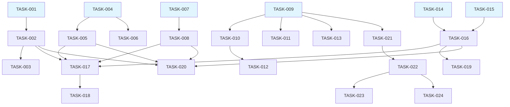

# Task Assignments - Ultimate Media Downloader Implementation
Generated: 2025-11-06
Project: Ultimate Media Downloader v3.0.0 - Missing Features

## Task Assignment Table

| Task ID  | Description | Type | Assigned Sub-Agent | Dependencies | Effort | Status |
|----------|-------------|------|-------------------|--------------|--------|--------|
| TASK-001 | Channel Info Extraction Service - Build service to extract and filter channel videos | Backend Development | backend-architect | None | 8 hours | To Do |
| TASK-002 | Channel API Endpoints - Create REST endpoints for channel operations | Backend Development | backend-architect | TASK-001 | 6 hours | To Do |
| TASK-003 | Channel Video Filtering UI - Build interactive UI for browsing and filtering channel videos | Frontend Development | frontend-developer | TASK-002 | 12 hours | To Do |
| TASK-004 | Batch Processing Service - Implement concurrent batch download manager | Backend Development | python-expert | None | 10 hours | To Do |
| TASK-005 | Batch API Endpoints - Create endpoints for batch download operations | Backend Development | backend-architect | TASK-004 | 4 hours | To Do |
| TASK-006 | Concurrent Download Manager - Extend queue manager for parallel processing | Backend Development | python-expert | TASK-004 | 8 hours | To Do |
| TASK-007 | Webhook Service Implementation - Build webhook dispatch with retry logic | Backend Development | backend-architect | None | 12 hours | To Do |
| TASK-008 | Webhook Event Integration - Integrate webhooks with download lifecycle | Backend Development | backend-architect | TASK-007 | 6 hours | To Do |
| TASK-009 | React/Vue Application Setup - Initialize frontend framework with routing | Frontend Development | frontend-developer | None | 8 hours | To Do |
| TASK-010 | Download Form Components - Create main download UI with advanced options | Frontend Development | frontend-developer | TASK-009 | 10 hours | To Do |
| TASK-011 | Real-time Progress WebSocket - Implement WebSocket for live progress updates | Frontend Development | frontend-developer | TASK-009 | 8 hours | To Do |
| TASK-012 | Mobile-Responsive UI - Make interface fully responsive for all devices | Frontend Development | frontend-developer | TASK-010 | 10 hours | To Do |
| TASK-013 | PWA Configuration - Set up Progressive Web App with offline support | Frontend Development | frontend-developer | TASK-009 | 6 hours | To Do |
| TASK-014 | Cookie Storage Service - Build encrypted cookie management system | Backend Development | backend-architect | None | 8 hours | To Do |
| TASK-015 | Browser Cookie Extraction - Implement browser cookie extraction utilities | Backend Development | python-expert | None | 10 hours | To Do |
| TASK-016 | Cookie API Endpoints - Create authentication endpoints for cookie management | Backend Development | backend-architect | TASK-014, TASK-015 | 4 hours | To Do |
| TASK-017 | Integration Testing - Test all new features end-to-end | QA/Testing | qa-engineer | TASK-001, TASK-002, TASK-003, TASK-004, TASK-005, TASK-006, TASK-007, TASK-008 | 16 hours | To Do |
| TASK-018 | Performance Testing - Load test channel, batch, and webhook features | QA/Testing | qa-engineer | TASK-017 | 8 hours | To Do |
| TASK-019 | Security Audit - Review cookie encryption and webhook signatures | Security | security-engineer | TASK-014, TASK-015, TASK-016 | 6 hours | To Do |
| TASK-020 | API Documentation - Document all new endpoints with OpenAPI | Documentation | documentation-engineer | TASK-002, TASK-005, TASK-008, TASK-016 | 8 hours | To Do |
| TASK-021 | Frontend Build System - Configure webpack/vite for production builds | DevOps | devops-engineer | TASK-009 | 4 hours | To Do |
| TASK-022 | Docker Configuration - Update containers for frontend and new services | DevOps | devops-engineer | TASK-021 | 6 hours | To Do |
| TASK-023 | Monitoring Setup - Configure Prometheus metrics and alerts | DevOps | devops-engineer | TASK-022 | 4 hours | To Do |
| TASK-024 | Deployment Pipeline - Set up CI/CD for Railway deployment | DevOps | devops-engineer | TASK-022 | 6 hours | To Do |

## Summary by Sub-Agent

### backend-architect (52 hours)
- TASK-001: Channel Info Extraction Service (8h)
- TASK-002: Channel API Endpoints (6h)
- TASK-005: Batch API Endpoints (4h)
- TASK-007: Webhook Service Implementation (12h)
- TASK-008: Webhook Event Integration (6h)
- TASK-014: Cookie Storage Service (8h)
- TASK-016: Cookie API Endpoints (4h)
- TASK-020: API Documentation (4h)

### frontend-developer (54 hours)
- TASK-003: Channel Video Filtering UI (12h)
- TASK-009: React/Vue Application Setup (8h)
- TASK-010: Download Form Components (10h)
- TASK-011: Real-time Progress WebSocket (8h)
- TASK-012: Mobile-Responsive UI (10h)
- TASK-013: PWA Configuration (6h)

### python-expert (28 hours)
- TASK-004: Batch Processing Service (10h)
- TASK-006: Concurrent Download Manager (8h)
- TASK-015: Browser Cookie Extraction (10h)

### qa-engineer (24 hours)
- TASK-017: Integration Testing (16h)
- TASK-018: Performance Testing (8h)

### security-engineer (6 hours)
- TASK-019: Security Audit (6h)

### documentation-engineer (8 hours)
- TASK-020: API Documentation (8h)

### devops-engineer (20 hours)
- TASK-021: Frontend Build System (4h)
- TASK-022: Docker Configuration (6h)
- TASK-023: Monitoring Setup (4h)
- TASK-024: Deployment Pipeline (6h)

## Critical Path Analysis

The critical path through the project is:
1. **Backend Foundation** (Parallel tracks):
   - Channel: TASK-001 → TASK-002 → TASK-003 (26h)
   - Batch: TASK-004 → TASK-005 → TASK-006 (22h)
   - Webhook: TASK-007 → TASK-008 (18h)
   - Auth: TASK-014 + TASK-015 → TASK-016 (22h)

2. **Frontend Development** (Sequential):
   - TASK-009 → TASK-010 → TASK-012 (28h)
   - TASK-009 → TASK-011 (16h parallel)
   - TASK-009 → TASK-013 (14h parallel)

3. **Integration & Testing**:
   - TASK-017 → TASK-018 (24h)
   - TASK-019 (6h parallel)

4. **Deployment**:
   - TASK-021 → TASK-022 → TASK-024 (16h)
   - TASK-023 (4h parallel)

**Minimum Project Duration**: ~3 weeks with parallel execution
**Recommended Team Size**: 7 engineers working in parallel

## Dependency Graph

## Execution Phases

### Phase 1: Foundation (Week 1)
**Parallel Execution**:
- Backend architects start on TASK-001, TASK-007, TASK-014
- Python experts begin TASK-004, TASK-015
- Frontend developer initializes TASK-009
- Total: 6 engineers working in parallel

### Phase 2: API Development (Week 1-2)
**Sequential after foundations**:
- Complete TASK-002, TASK-005, TASK-008, TASK-016
- Frontend continues with TASK-010, TASK-011
- Start TASK-006 for batch concurrency

### Phase 3: UI Implementation (Week 2)
**Frontend Focus**:
- Complete TASK-003, TASK-012, TASK-013
- Backend team assists with WebSocket integration
- Begin integration testing (TASK-017)

### Phase 4: Testing & Deployment (Week 3)
**Quality Assurance**:
- Execute TASK-017, TASK-018, TASK-019
- Complete TASK-020 documentation
- Deploy with TASK-021, TASK-022, TASK-023, TASK-024

## Risk Mitigation by Task

| Task ID | Risk | Mitigation |
|---------|------|------------|
| TASK-001 | Channel API rate limits | Implement caching and backoff |
| TASK-004 | Memory overflow with large batches | Stream processing, limit batch size |
| TASK-007 | Webhook flooding | Rate limiting, queue implementation |
| TASK-011 | WebSocket browser compatibility | Polling fallback mechanism |
| TASK-014 | Encryption key management | Secure key storage, rotation strategy |
| TASK-015 | Browser security restrictions | Manual fallback instructions |

## Success Criteria per Task

Each task must meet these criteria before marking complete:

1. **Code Complete**: Implementation finished and working
2. **Tests Written**: Unit tests with >80% coverage
3. **Documentation**: Code comments and API docs updated
4. **Code Review**: Peer reviewed and approved
5. **Integration**: Works with dependent components
6. **Performance**: Meets defined SLAs
7. **Security**: Passes security checklist

## Notes for Sub-Agents

### Backend Engineers
- Follow existing modular architecture in app/ directory
- Use async/await patterns consistently
- Implement proper error handling and logging
- Write comprehensive docstrings

### Frontend Engineers
- Mobile-first responsive design
- Accessibility (WCAG 2.1 AA) compliance
- Progressive enhancement approach
- Optimize for Core Web Vitals

### QA Engineers
- Test on all target browsers and devices
- Include edge cases and error scenarios
- Performance testing under load
- Security testing for vulnerabilities

### DevOps Engineers
- Zero-downtime deployment strategy
- Monitoring and alerting setup
- Backup and recovery procedures
- Documentation for operations team

---

**Status Legend**:
- **To Do**: Task not started, ready for assignment
- **In Progress**: Currently being worked on
- **Blocked**: Waiting on dependencies or external factors
- **Completed**: Finished and tested

**Last Updated**: 2025-11-06
**Project Manager**: Technical Planning Agent